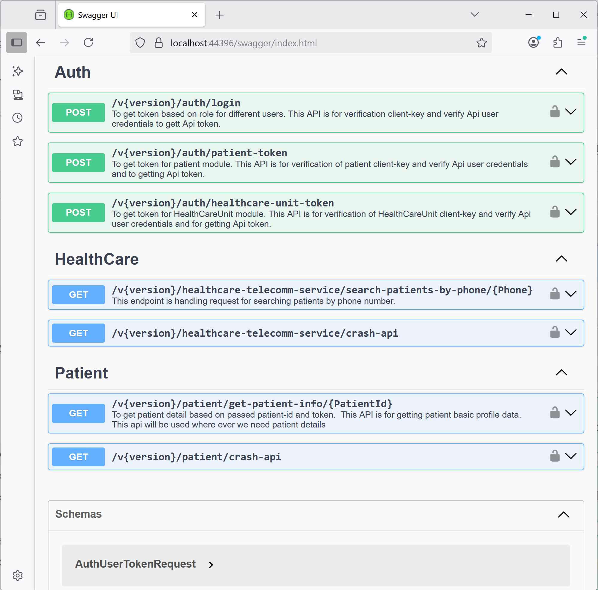

# ASP.NET Core 9 Healthcare Web API

A scalable Web API Application built using **ASP.NET Core 9** and **Clean Architecture** principles, designed for healthcare systems. It provides JWT-based authentication, role and policy-based authorization, JSON-based configuration, and supports versioning, CORS, and Swagger.



---

## Features Overview

### 🔐 Authentication & Authorization

- **JWT Token Authentication** with customizable expiry durations.
- **Serilog Integration** for persistent logging.
- **Role-Based and Policy-Based Authorization** for endpoint protection.
- **User Management**:
  - Add multiple users.
  - A single role can be associated with multiple users.
  - User accounts can be disabled/enabled at runtime.
  - JWT payload contains either `Patient GUID` or `HealthCareUnit GUID` to categorize healthcare clients.

---

### 🌐 API Design & Access

- **Swagger/OpenAPI** integrated for interactive API testing.
- **API Versioning** implemented to support evolution and backward compatibility.
- **JSON-Based Data Access** for simplified, schema-driven storage without a full RDBMS.
- **CORS Support** enabled for secure cross-origin communication between frontend and backend.

---

### 🧱 Infrastructure & Middleware

- **Centralized Exception Handling** using custom middleware.
- **Request Logging** middleware that logs incoming requests and response times (in milliseconds).
- **Token Event Logging** logs token generation, validation success/failures.
 
---

## 🚀 Getting Started

### Prerequisites

- [.NET 9 SDK](https://dotnet.microsoft.com/en-us/download)
- [Visual Studio 2022+](https://visualstudio.microsoft.com/)
- Nuget Packages

### Run Locally

- Download & Open the project using Visual Studio.
- Update JWT Users & JWT Settings in appsettings.json (Optional)
- Install Nuget Packages being used in this project:
    - Go to Tools >> Nuget Package Manager >> Manage Nuget Packages Solution
- Clean and build the solution
- Run the project:
    - From Visual Studio toolbar, Select "Debug", "Any CPU" and "IIS Express" Options
    - Click the green "play" button in the Visual Studio toolbar.
- Then open your browser at:

```
https://localhost:{port}/swagger/index.html
```
### Test APIs in Swagger
- Create API Token:
 - Expand the Auth controller, and then expand "/v{version}/auth/login" end point
 - Click the button "Try Out", it will allow you to enter the param
 - Enter value 1 in Version* textbox
 - In Request Body Section, Select "application/json" and enter the following User json schema (Key,User, Password)
 
 ```
 {
  "ClientKey": "b1c2d3e4-f5a6-7b8c-9d0e-f1a2b3c4d5e6",
  "Username": "User1",
  "Password": "User1Password"
}
 ```

 - Clicking on execute button, should create API token. You can use this token to test other APIs related to this User Role.

- NOTE: 
    - ClientKey: Either will be HealthCare Unit GUID  value (healthcareunits.js) or Patient GUID value (patients.json)
    - Username & Password: any JWT user from appsettings.json

---

## 📂 Project Structure

```
/aspnetcore-healthcare-webapi
│
├── Common/
├── Controllers/
│   └── ApiBaseController.cs          # API Base Controller
│   └── AuthController.cs             # Handles operations related to JWT tokens.
│   └── HealthCareController.cs       # Handles operations related to Healthcare units.
│   └── PatientController.cs          # Handles operations related to patients.
├── Data/
│   └── healthcareunits.json          # Custom healthcare units data store (read/write)
│   └── patients.json                 # Custom patients data store (read/write)
├── DataRepository/
│   └── AuthRepository.cs             # Handles JWT tokens related data operations
│   └── BaseRepository.cs             # Base Repository for reading settings, connection Strings and other configurations
│   └── ErrorLogRepository.cs         # To Log exeptions
│   └── HealthCareRepository.cs       # Handles data operations related to Healthcare units.
│   └── PatientRepository.cs          # Patient related data operations
├── Middleware/
├── Models/
├── appsettings.json     # Configuration for JWT, users, logging
├── Program.cs           # Entry point with middleware pipeline

```
---

## 📘 License

This project is licensed under the MIT License. See the [LICENSE](LICENSE.txt) file for details.

---

## Starred
If you find this project useful, please consider supporting us by giving a star on GitHub! ⭐

---

## 🌱 Help Us Grow!
Please help us grow by sharing it with your friends, family, and colleagues!